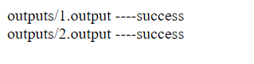

# Metric Analyser

The scope of the test is to generate the expected output files (in the `public/outputs` folder) given the input files (in the `public/inputs` folder).

## Laravel Installation

Use the composer manager to install Laravel packages.

```bash
composer install
```


## Run Server
```bash
// Laravel
cd metric-analyser
php artisan serve

```
Before that put inputs folder into public/inputs in Laravel project.
After that run below url to generate output files.
```
http://127.0.0.1:8000/metric-analyser
```
## Home page UI


## Author
Chiragkumar Patel

